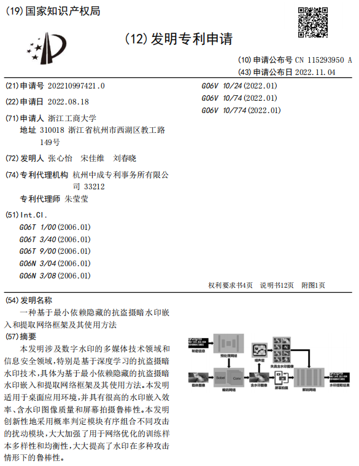

展开查看

watermark项目自2022年4月9日开始，tensorboard命令行可视化 ： tensorboard --logdir=runs/；调用库__from tensorboardX import SummaryWriter__；在终端使用命令: 转到runs目录的根目录, tensorboard --logdir=runs/;连接ssh后,在本地使用__http://localhost:16006/__
__tensorboard --logdir='runs' --port=6006__

# 一种基于最小依赖隐藏的抗盗摄图形暗水印算法

* 已申请专利

* 论文修后发表~~，这个期刊卡了大半年也是好意思催我的~~

* 获得某不知名奖项

# 项目简介

* 用于暗水印的深度学习方法
* 按照UDH(Universal deep hide)方法,加入传统方法LSB,修改部分Loss 函数组成。
* 使用数据集为 __DIV2K_train_HR__

# train
* 在dataloader.py中修改数据集目录,运行train目录下Train,内存原因，只能训练512 *  512大小，原本设计要1024 *  2048大小 

# data
* 目录下data文件夹放入训练数据集

# 实验记录
## 2022/4/9

 loss_o_sec * 3 + loss_lpips_mean * 0.7 + loss_res * 0.2   实验结构，可以获取清晰结果，但是无法隐藏

* 2022/4/10
无法抵抗截图攻击，拍照攻击等，主要原因在于字体太小，无法看清，下一步思路：加入仿射缩小变换

## 2022/4/11
lsbdata.py代码未更新，train和utils.py代码未更新
* 计算loss的位置有问题，经过了扰动，不能和gt直接比较，loss位置有问题。计算视觉感知损失有关的loss和noise layer无关，在noise layer之前（已修改）（训练已完成）
* 仍旧无法解决放大缩小攻击和拍照攻击
* 实际上拍照攻击本身包含了缩放的操作，对于现代手机摄像机，拍摄大小往往大于实际大小。

## 2022/4/13
* 参考源码 url: __https://github.com/mlomnitz/DiffJPEG__ 加入JPEG压缩
* 使用jpeg压缩，不加入概率会出问题 
* 加入信息熵损失
* 是否扰动过于苛刻，crop+压缩+变形+光照+UDH,换为ddh是否更好，应当具有cover的信息才能够使得变化较大

## 2022/4/14
* 在维持图像质量的前提下，可以抵抗多种攻击手段
* JPEG压缩质量不能过低
* 怀疑UDH方法是否能够用于桌面水印(UDH方法的改动多在高频区域)，问题在于高频信息是否在拍摄过程中被相机接收
* UDH方法没有前途

## 2022/4/15
* 使用DDH方法，失败，noise_layer没有正常运行，概率过低

## 2022/4/17
* 还是使用UDH方法，符合应用场景，虽然无法抵抗JPEG压缩方式

## 2022/5/29
* 获取仿射非线性变换透视扭曲图像，该过程可微
> import torchvision.transforms as transform
> transform.RandomAffine(degrees=0, translate=(0, 0), shear=[20,90])(img0)
>在transform的1100行-1105行处修改源码
>使得randomAffine去除随机性，仿射角度为参数1和参数2的平均
>之后使用需要把源码改为注释内的内容
>

# 2022/6/27
* 加入大字和结构图，在train2.py,为LDH,依赖cover进行运算的部分占比较少。

# 2022/6/30
* `拍照`勉强实现，必要条件是足够大的secret（低频）
* `光照/对比度`损失，无法提取
* 复现stegastamp，已有torch代码，暂时不管

# 2022/7/2
* cfg文件夹为使用stegastamp所需的超参数表，直接引用，不看

# 2022/7/9
* noise layer设置为直接式（还是咱家自己的noise layer好）
* 开始调参，增加图像质量类loss

# 2022/7/12 
* 可以考虑把传统方法给集成进去，但是没必要，说一声就行，具有加入多重水印的鲁棒性

IF <rand()%2 ==true> Then
    {
        disturb_jpeg(quality=[80,85,90,95]);
    /}
IF <rand()%2 ==true> Then
    {
        disturb_warp();
    /}
IF <rand()%2 ==true> Then
    {
        disturb_jpeg(quality=[70, 80, 90, 95]);
    /}
IF <rand()%2 ==true> Then
    {
        disturb_blur();
    /}
IF <rand()%2 ==true> Then
    {
        disturb_brightness();
    /}    

* show the res of container and cover.the the color point of the res is * 15  than the normal.

* the cover picture is as follow.

* the screen shoot and reveal is as follow. However we need to screen-shoot more carefully. 

# 2022/8/6

* 训练无sobel算子的对比模型
* 猜测无sobel在当前的noise下是没有问题的，但是在更强的noise下会出问题
* 实际上，导致变色

# 2022/8/13
* 训练单通道水印图像
* github 选中$ git push origin master -f 提交选项会把提交记录也给替换掉的，很糟糕

# 2023/4/20

* 写一写readme

# install the requirements
* pip install -r requirements.txt
* pip install torch==1.8.1+cu101 torchvision==0.9.1+cu101  --extra-index-url https://download.pytorch.org/whl/cu101  to install torch in cuda. 

# where is the checkpoint

* the pretrained  checkpoints are in ./save_model/0710
* that is the checkpoint shown in the paper
* there are many other checkpoints that have different presentation

# how to train
* 运行train/train_paper.py  即可
* 在无噪声层模式下训练5-10个epoch，获得预训练模型，于train/train_paper.py中调整预训练模型路径参数
* 训练直到水印正常
# how to use in remote destop
* see in ./remote-destop-master
* 调整该目录下的checkpoint和ip地址

# how to run in dataset

* change the checkpoint paths in line 35,36
* run test/test2.py

# how to test

* rather than run in datasets,run test/test_film.py to test in screen recording data
* run test/test_watermark2.py to reveal the watermark in container
* run test/ssim_psnr.py to get the SSIM and PSNR of our arithmetic
* and the test_watermark.py is not available now.

# how to encode a watermark

* run test_hide()   in test/test_watermark2.py

# how to decode a watermark

* run test_rev() in test/test_watermark2.py

# does the screen shoot watermark need to test in many datasets?

* in fact,different from the normal objects,when we test the screen shoot watermark ,the picture  we use is just different from the train dataset.

# test the code in webui!

* run app.py in test file

